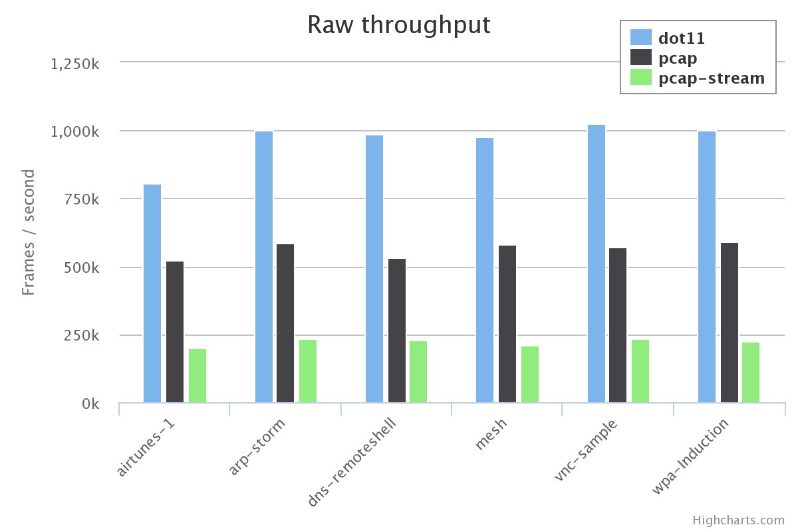

# Dot11 [](https://www.npmjs.com/package/dot11) [](https://travis-ci.org/mtth/dot11)

`dot11` leverages Node.js' built-in [streams][] to provide an intuitive and
efficient interface for frame capture and injection. It also provides decoders
for various link types.

```javascript
var dot11 = require('dot11');

var capture = new dot11.capture.Live('en0', {monitor: true});
var decoder = new dot11.transform.Decoder();

capture                     // Stream of buffers (frames' raw bytes).
  .pipe(decoder)            // Stream of objects (decoded frames).
  .on('data', function (frame) {
    console.log(JSON.stringify(frame));
  });
```


## Installation

```bash
$ npm install dot11
```

`dot11` depends on [libpcap][]. Note that you might also need to run live
captures as root.


## Documentation

[API docs](doc/api.md) and several [examples](doc/examples.md) are available.


## Benchmarks

[](doc/benchmarks.md#capture)

See [here](doc/benchmarks.md) for more details.


## Tests

```bash
$ npm test
```

Some tests require an active internet connection.


[Radiotap]: http://www.radiotap.org/
[streams]: http://nodejs.org/api/stream.html
[libpcap]: http://www.tcpdump.org/
[node_pcap]: https://github.com/mranney/node_pcap
[pcap-stream]: https://github.com/wanderview/node-pcap-stream
