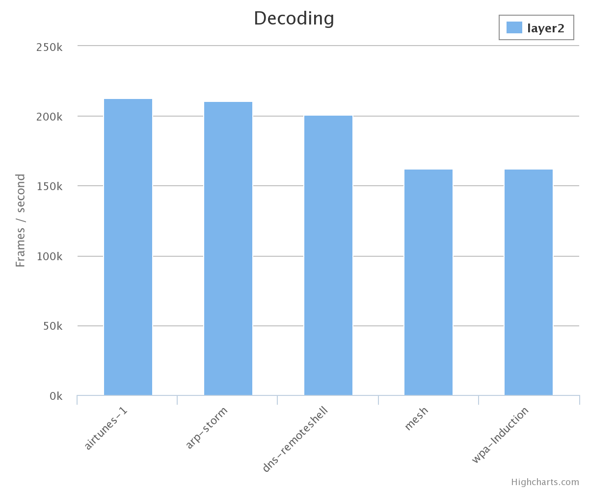

# Performance benchmarks

Captures are downloaded from the [Wireshark sample captures page][captures].

In order to run these benchmarks you'll need to install the development
dependencies.


## Capture

This benchmark measures the rate at which frames are processed while replaying
a capture. This can be viewed as an upper bound on the maximum sustainable live
capture rate.

```bash
$ npm run benchmark-capture

# ...

# airtunes-1 (62543 frames, 20 runs)
73.91 ms (±0.62)         0.85 f/us       676.45 B/us            layer2
122.48 ms (±1.14)        0.51 f/us       408.23 B/us    -40%    pcap
347.56 ms (±6.95)        0.18 f/us       143.86 B/us    -79%    pcap-stream

# arp-storm (833333 frames, 20 runs)
778.32 ms (±15.47)       1.07 f/us       64.24 B/us             layer2
1340.60 ms (±6.07)       0.62 f/us       37.30 B/us     -42%    pcap
3870.05 ms (±35.60)      0.22 f/us       12.92 B/us     -80%    pcap-stream

# dns-remoteshell (286218 frames, 20 runs)
296.29 ms (±3.62)        0.97 f/us       168.75 B/us            layer2
510.71 ms (±5.06)        0.56 f/us       97.90 B/us     -42%    pcap
1368.78 ms (±12.89)      0.21 f/us       36.53 B/us     -78%    pcap-stream

# mesh (328613 frames, 20 runs)
338.98 ms (±2.43)        0.97 f/us       147.50 B/us            layer2
562.77 ms (±2.69)        0.58 f/us       88.85 B/us     -40%    pcap
1506.16 ms (±4.20)       0.22 f/us       33.20 B/us     -77%    pcap-stream

# vnc-sample (494136 frames, 20 runs)
493.79 ms (±7.06)        1.00 f/us       101.26 B/us            layer2
814.54 ms (±2.43)        0.61 f/us       61.38 B/us     -39%    pcap
2355.64 ms (±34.33)      0.21 f/us       21.23 B/us     -79%    pcap-stream

# wpa-Induction (337787 frames, 20 runs)
373.25 ms (±7.89)        0.90 f/us       133.96 B/us            layer2
614.10 ms (±8.46)        0.55 f/us       81.42 B/us     -39%    pcap
1674.25 ms (±21.48)      0.20 f/us       29.86 B/us     -78%    pcap-stream
```


Average raw throughput:

+ `layer2`: 0.93 million frames per second.
+ [`pcap`][node_pcap]: 0.57 million frames per second.
+ [`pcap-stream`][pcap-stream]: 0.21 million frames per second.

Note that in order to reduce the setup and teardown costs the capture files are
replicated to reach a size of a few megabytes. This way only the marginal frame
processing time matters.


## Decoding

This benchmark estimates the rates at which raw frames can be decoded into
JavaScript objects.

```bash
$ npm run benchmark-capture

# ...

# airtunes-1 (62543 frames, 20 runs)
293.64 ms (±2.08)        0.21 f/us       170.27 B/us            layer2

# arp-storm (833333 frames, 20 runs)
3954.15 ms (±37.66)      0.21 f/us       12.64 B/us             layer2

# dns-remoteshell (286218 frames, 20 runs)
1425.97 ms (±4.64)       0.20 f/us       35.06 B/us             layer2

# mesh (328613 frames, 20 runs)
2029.56 ms (±6.17)       0.16 f/us       24.64 B/us             layer2

# wpa-Induction (337787 frames, 20 runs)
2077.85 ms (±5.99)       0.16 f/us       24.06 B/us             layer2
```



Note that it doesn't make as much sense to benchmark against the previous
libraries since they focus on the upper layers rather than decode information
from the data link layer.


[captures]: http://wiki.wireshark.org/SampleCaptures
[node_pcap]: https://github.com/mranney/node_pcap
[pcap-stream]: https://github.com/wanderview/node-pcap-stream
